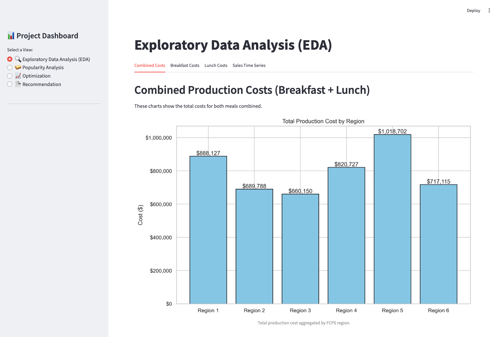
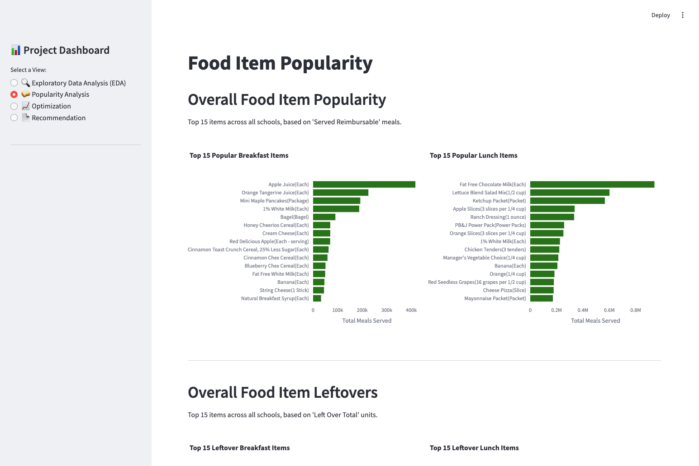
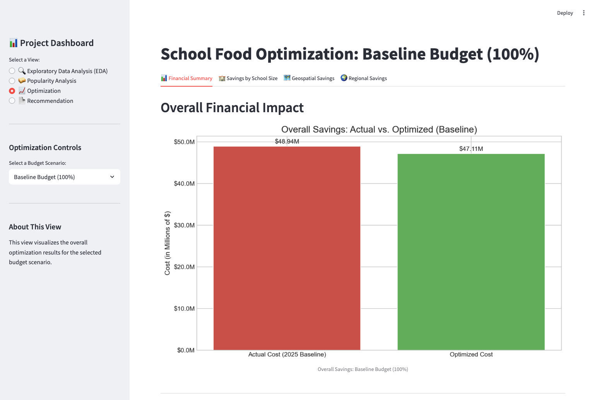
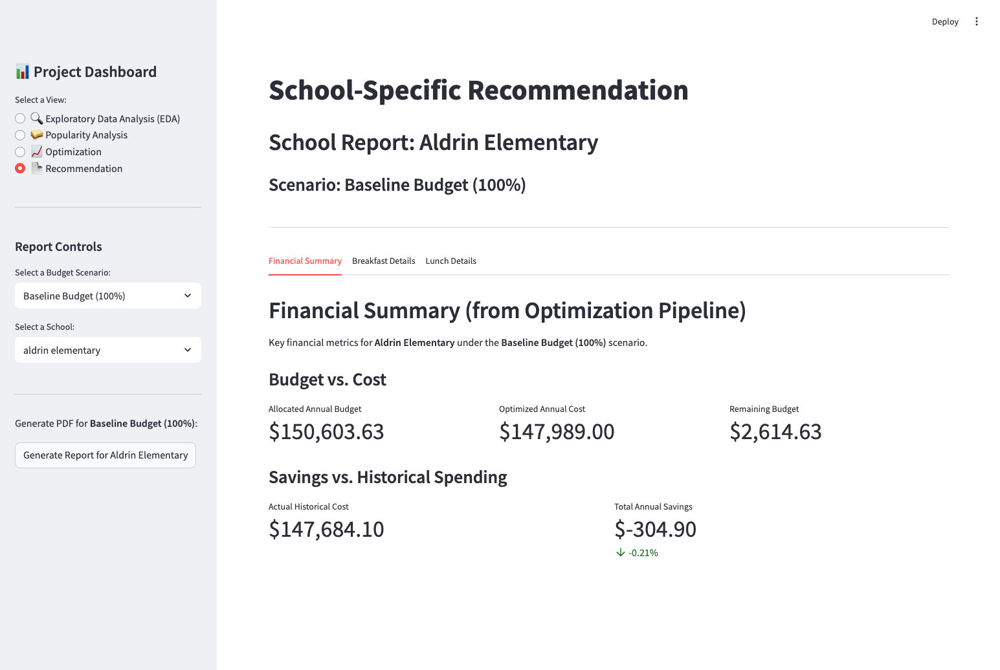

# 📊 Project Dashboard (User Interface)

This directory contains the source code for the interactive Streamlit Dashboard. This web application serves as the frontend for the project, allowing users to visualize data, food popularity, and optimization results without touching the backend code.

## 🖼️ Overview

The dashboard is designed to provide stakeholders with actionable insights through four main pages:
1. __Exploratory Data Analysis (EDA)__: Exploratory Data Analysis of the initial data.
2. __Popularity Analysis__: Visual breakdown of food item performance.
3. __Optimization__: An interactive interface to view the results of the optimization models generated by the backend.
4. __Recommendation__: Provides a downloadable recommendation form for stakeholders to follow our optimization results.

---

## ⚙️ Prerequisites

Before running the dashboard, ensure you have:
1. __Generated the Data__: The dashboard relies on CSV files and graphs created by the backend. You must run the main pipeline first:

```bash
python src/main/main.py
```

2. __Installed Dependencies__: Ensure Streamlit and other UI libraries are installed.

```bash
pip install -r ../requirements.txt
```

---

## 🚀 How to Run

To launch the web application locally:
1. Navigate to the project root directory.
2. Run the following command:

```bash
streamlit run demo/streamlit_app.py
```

_Note: If your command prompt is already inside the `demo` folder, use `streamlit run streamlit_app.py` instead._

Once the server starts, a new tab will automatically open in your default browser at `http://localhost:8501`

---

## 📂 File Structure

```
demo/
├── fig/                           # Figures, Videos
├── images/                        # Images
└── pages/                         # Individual sub-pages for the dashboard
    ├── 0⚡Quick Overview.py
    ├── 1🏭 Production EDA.py
    ├── 2📊 Sales EDA.py
    ├── 3🔮Future Ideas.py
    ├── 4📊Results.py
    └── streamlit_app.py           # Main entry point for the Streamlit application
```

---

## 📸 Dashboard Preview

1. ### __Exploratory Data Analysis__

_Visualizes key exploratory data analysis, across costs and time series._



2. ### __Popularity Analysis__

_Visualizes top 15 popular foods for each meal type and the top 15 most leftover items for each meal type_



3. ### __Optimization__

_Visualizes results from our optimization model_



4. ### __Recommendation__

_Allows the user to download a recommendation form for optimized food item quantities to order_

