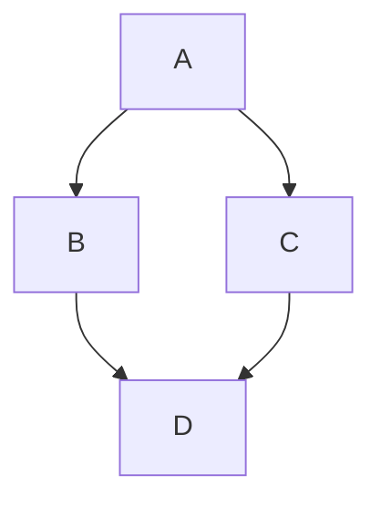

Note: Use Markdown Cheat Sheet download in the directory as needed.

- Useful links
  - https://github.com/im-luka/markdown-cheatsheet

---
## Date: Week 1 - August 27, 2025
- Topics of discussion
    - which proposal to choose

- Action Items:

* [x] creation of github repository
---

## Date: Week 2 - September 3, 2025
- Topics of discussion
    - confirm proposal choice
    - discuss project outline

- Action Items:

* [x] clean up github into correct structure
* [ ] Alonso: look into creating a website (html, c++)
* [ ] Alonso: look into UI platforms
* [ ] Crystal: check data and do simple EDA
* [ ] Crystal: look up resources on food waste
* [ ] Jupiter: research timeseries and compare different models
---
## Date: Week 3 - September 10, 2025 
- Topics of discussion
    - timeseries model and date range
    - preprocessing code
    - popularity of items
    - maybe create a regression to create a budget
    - list of additional questions for the client

- Action Items:

* [ ] Crystal: run the preprocessing code for pdf and html conversion
* [ ] Alonso: look into GLM for creating a budget
* [ ] Jupiter: decide on timeseries models to run on the data
---
## Date: Week 4 - Month Day Year 
- Topics of discussion
    - Item1
    - Item2
    - Item3

- Action Items:

* [ ] Action Item 1
* [ ] Action Item 2
* [ ] Action Item 3
* [ ] Action Item 4
* [ ] Action Item 5
---
## Date: Week 5 - Month Day Year 
- Topics of discussion
    - Item1
    - Item2
    - Item3

- Action Items:

* [ ] Action Item 1
* [ ] Action Item 2
* [ ] Action Item 3
* [ ] Action Item 4
* [ ] Action Item 5
---
## Date: Week 6 - Month Day Year 
- Topics of discussion
    - Item1
    - Item2
    - Item3

- Action Items:

* [ ] Action Item 1
* [ ] Action Item 2
* [ ] Action Item 3
* [ ] Action Item 4
* [ ] Action Item 5
---
## Date: Week 7 - Month Day Year 
- Topics of discussion
    - Item1
    - Item2
    - Item3

- Action Items:

* [ ] Action Item 1
* [ ] Action Item 2
* [ ] Action Item 3
* [ ] Action Item 4
* [ ] Action Item 5
----
## Date: Week 8 - Month Day Year 
- Topics of discussion
    - Item1
    - Item2
    - Item3

- Action Items:

* [ ] Action Item 1
* [ ] Action Item 2
* [ ] Action Item 3
* [ ] Action Item 4
* [ ] Action Item 5
---

## Date: Week 9 - Month Day Year 
- Topics of discussion
    - Item1
    - Item2
    - Item3

- Action Items:

* [ ] Action Item 1
* [ ] Action Item 2
* [ ] Action Item 3
* [ ] Action Item 4
* [ ] Action Item 5
---
## Date: Week 10 - Month Day Year 
- Topics of discussion
    - Item1
    - Item2
    - Item3

- Action Items:

* [ ] Action Item 1
* [ ] Action Item 2
* [ ] Action Item 3
* [ ] Action Item 4
* [ ] Action Item 5
---
## Date: Week 11 - Month Day Year 
- Topics of discussion
    - Item1
    - Item2
    - Item3

- Action Items:

* [ ] Action Item 1
* [ ] Action Item 2
* [ ] Action Item 3
* [ ] Action Item 4
* [ ] Action Item 5
---
## Date: Week 12 - Month Day Year 
- Topics of discussion
    - Item1
    - Item2
    - Item3

- Action Items:

* [ ] Action Item 1
* [ ] Action Item 2
* [ ] Action Item 3
* [ ] Action Item 4
* [ ] Action Item 5
---
## Date: Week 13 - Month Day Year 
- Topics of discussion
    - Item1
    - Item2
    - Item3

- Action Items:

* [ ] Action Item 1
* [ ] Action Item 2
* [ ] Action Item 3
* [ ] Action Item 4
* [ ] Action Item 5
---
## Date: Week 14 - Month Day Year 
- Topics of discussion
    - Item1
    - Item2
    - Item3

- Action Items:

* [ ] Action Item 1
* [ ] Action Item 2
* [ ] Action Item 3
* [ ] Action Item 4
* [ ] Action Item 5
---
- **_Add Images and Diagrams Using Excalidraw_**
  - Just draw it and then copy as png paster in the editor


- **_Add Equation_**
  - $e^{\pi i} + 1 = 0$


- **_Add Pyhton Code_**

```
import numpy as np
a = np.array()
```

- **_Add Tables as needed._**

| Checkbox Experiments | checked header | crossed header |
| ---------------------|:--------------:|:--------------:|
| checkbox             |  &check; Row   |  &cross; row   |


- **_Add Tables as needed._**


|checked|unchecked|crossed|
|---|---|---|
|&check;|_|&cross;|
|&#x2611;|&#x2610;|&#x2612;|


- **_Add Tables as needed._**

| Selection |        |
| --------- | ------ |
| &#x2610;  |

| Selection |        |
| --------- | ------ |
| &#x2611; |

- **_Create Links as needed_**
  - [link text](full url minus the en-us locale)

- **_Add Geo Json_**

```geojson
{
  "type": "FeatureCollection",
  "features": [
    {
      "type": "Feature",
      "id": 1,
      "properties": {
        "ID": 0
      },
      "geometry": {
        "type": "Polygon",
        "coordinates": [
          [
              [-90,35],
              [-90,30],
              [-85,30],
              [-85,35],
              [-90,35]
          ]
        ]
      }
    }
  ]
}
```

- **_Add flow chart_**


