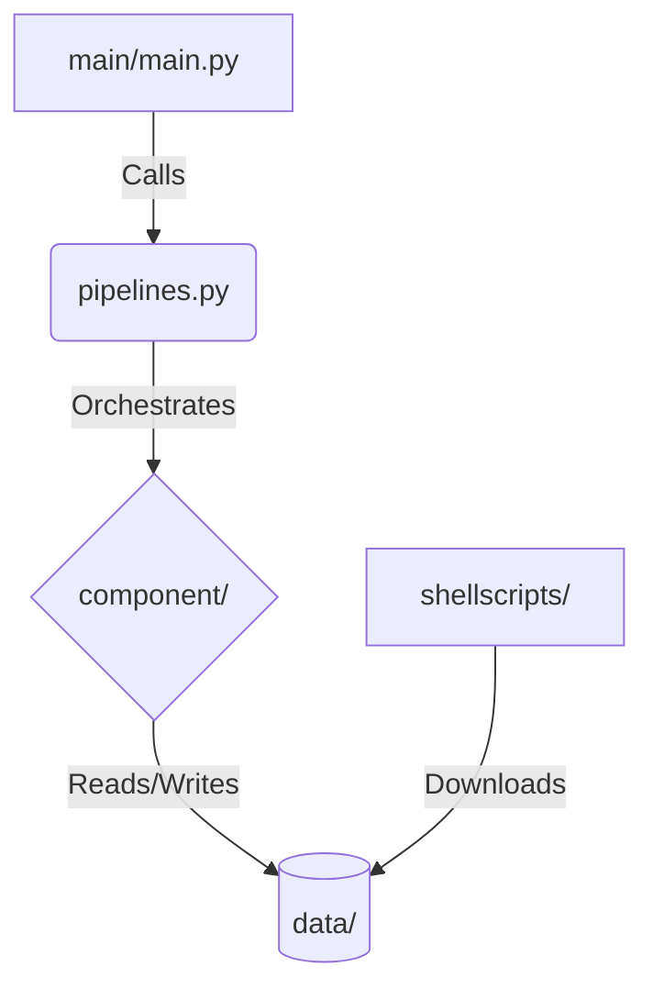

# 📂 Source Code Documentation (`src/`)

This directory contains the core logic, data processing pipelines, and analytical engines for the project. It handles everything from raw data ingestion to generating the final output CSVs and graphs used by the Dashboard.

## 🏗 Directory Structure
```
src/
├── component/        # Atomic functions and core logic modules
├── data/             # Central storage for Raw, Clean, and Output data
├── docs/             # Project documentation assets
├── main/             # Entry point (main.py) to execute the pipelines
├── preprocess/       # Logic for cleaning and structuring raw data
├── shellscripts/     # Utilities to fetch external data
└── tests/            # Unit tests for component validation

```

---

## 🔄 Logic & Execution Flow

This project follows a hierarchical execution structure. The __Main__ module acts as the driver, triggering __Pipelines__, which orchestrates specific tasks by calling functions from the __Component__ library.



---

## 📘 Module Breakdown

1. ### `main/` (The Driver)
- __Purpose__: Contains the entry point for the backend logic.
- __Functionality__: It triggers pipelines.py, which is responsible for running the end-to-end process.
- __Output__: Generates the final graphs and CSV files required by the UI (located in the `../demo` folder).

2. ### `component/` (The Toolkit)
- __Purpose__: The library of core functions.
- __Functionality__: Contains specific logic for optimization, regression analysis, and plotting. These functions are not run directly; they are imported and utilized by the pipeline.

3. ### `pipelines.py` (The Orchestrator)
- __Purpose__: Connects the main driver to the component functions.
- __Functionality__: It defines the sequence of operations (e.g., "Load Data" -> "Run Regression" -> "Save Output").

4. ### `data/` (The Storage)
This directory manages the data lifecycle:
- __Raw__: Unprocessed data (often HTML or raw downloads).
- __Clean__: Data processed by the preprocess/ module.
- __Output__: Final results generated by the analysis, ready for the UI.

5. ### `preprocess/` (The Processor)
- __Purpose__: Handles the raw data for cleaning and transformation.
- __Functionality__: Holds raw inputs to allow it to be cleaned so that the components can analyze without errors.

6. ### `shellscripts/` (The Fetcher)
- __Purpose__: Automation scripts for data setup.
- __Usage__: Run these scripts to download raw datasets if they are not already present on your local machine.

7. ### `tests/` (The Validator)
- __Purpose__: Quality assurance.
- __Functionality__: Contains unit tests to ensure functions in the component/ folder are calculating results as intended.

---

## 🚀 How to Run

To execute the full pipeline and generate fresh outputs for the dashboard:
1. __Ensure prerequisites are installed__ (see root README).
2. __Download Data__: If needed, run the shell scripts to fetch raw data.
3. __Run the Main Driver__:

```bash
python src/main/main.py
```
_(Note: Adjust the path based on your current working directory)_